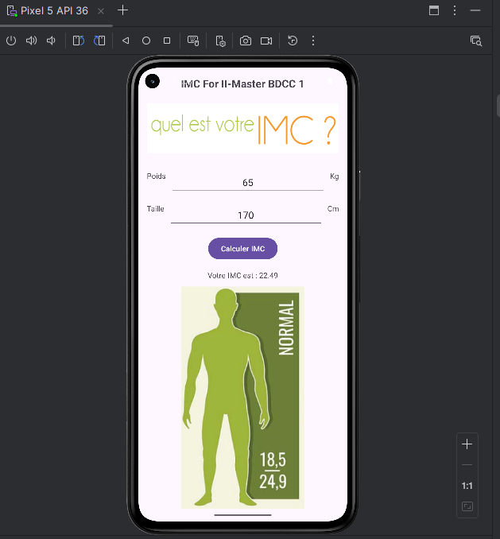
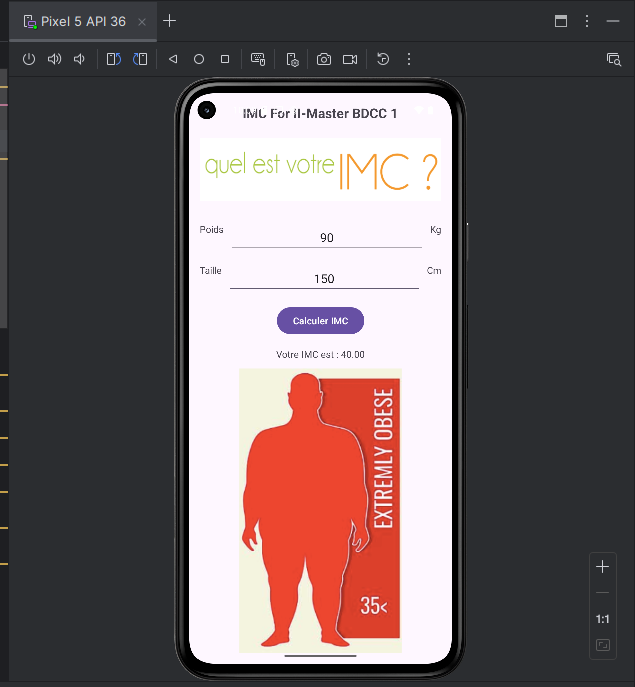
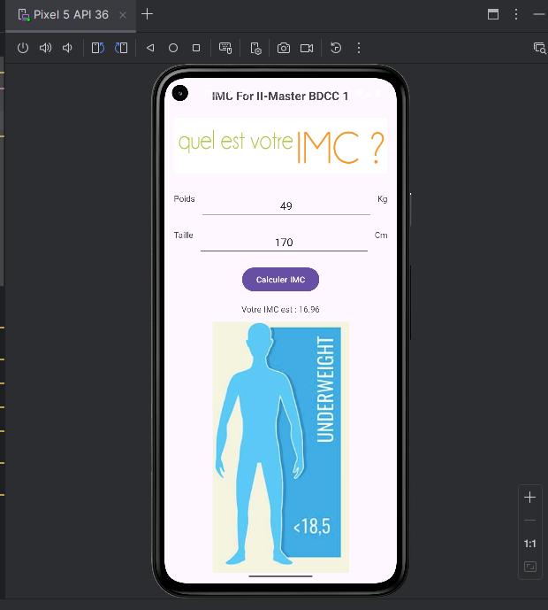
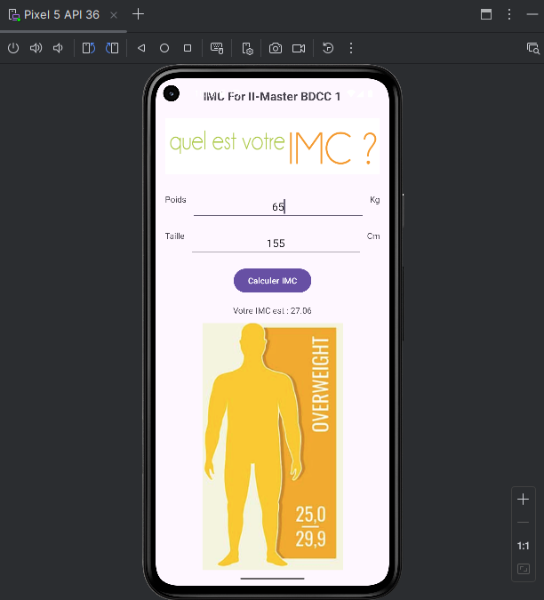
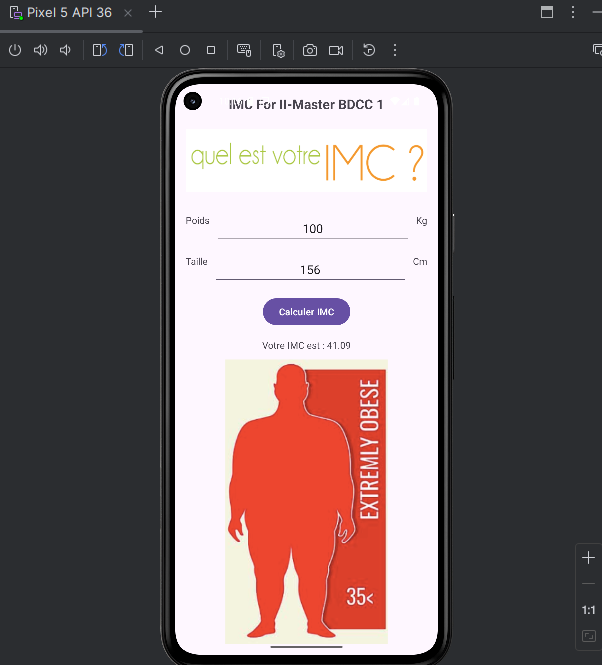

# Calcul IMC

## Description
Cette application calcule l’Indice de Masse Corporelle (IMC).
Elle permet à l’utilisateur de :

  - Saisir son poids et sa taille

    - Afficher la valeur de l’IMC

      - Afficher une image et un texte en fonction de la catégorie d’IMC :

         * Maigreur

         * Poids normal

        * Surpoids

       * Obésité

## Captures s'écran

